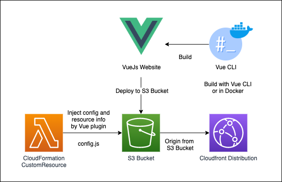

# AWS CDK with VueJs v3

[](https://badge.fury.io/js/%40softchef%2Fcdk-vue3)


AWS CDK with VueJs v3 package will auto deploy website with VueJs to S3 bucket and CloudFront distribution.

VueJs will build on local environment or docker container, it's based with Vite project. Then use S3-Deployment to upload to specify S3 bucket.

If you have many resource arguments will pass to frontend, the config property will generate config.js to specify S3 bucket. It's a VueJs extendsion and archive config in Vue.$config operation.



## Installation

```
  npm install @softchef/cdk-vue3
  // or
  yarn add @softchef/cdk-vue3
```

## Example
```
import { VueDeployment } from '@softchef/cdk-vue3'
// In your stack
// Basic deployment
const website = new VueDeployment(this, 'WebsiteDeployment', {
  source: `${CLIENTS_PATH}`,
  clientConfig: {
    config: {
      apiId: articleApi.restApiId, // RestApi
      userPoolId: userPool.userPoolId, // UserPool
      foo: {
        bar: {
          value: 123 // Customize config
        }
      }
    }
  }
})
```

## VueJs Example

```
// In public/index.html
<script type="text/javascript" src="/config.js">

// In main.js or app.js
app.use(window.VueDeploymentConfig)

// In *.vue
import { inject } from 'vue'

const $config = inject('$config')
$config.get('foo') // { bar: { value: 123 } }

```
